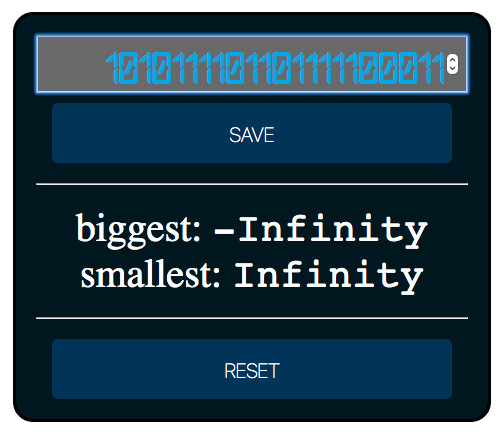

# Biggest & Smallest
> Starter Code exercises to practice javascript coding and learn how to build and use a data model to save the state of the webpages, complete exercise with listeners, handlers, data, init load and logging.

## Table of contents
* [General info](#general-info)
* [Screenshots](#screenshots)
* [Technologies](#technologies)
* [Setup](#setup)
* [Features](#features)
* [Status](#status)
* [Inspiration](#inspiration)
* [Contact](#contact)

## General info
The purpose of the project is to continue learning and using javascript on webpages, use data structures of the javascript language to save the state of webpages.

## Screenshots

## Technologies
* HTML5
* CSS3
* git
* javascript

## Setup
You can clone or fork this repository and test the files.

## Features
The project features a web site with:
* Input box with number to store, two functionality buttons, to result labels.
* Save button to store input number into data object 'numbers' with current, biggest, smallest and the all past currents array.
* Reset button to clear data object and restore init values.

## Status
Project is: finished, final version.

## Inspiration
[this repository](https://github.com/HackYourFutureBelgium/biggest-and-smallest)

## Contact
Created by [@ferrycosv](www.github.com/ferrycosv) - feel free to contact me!